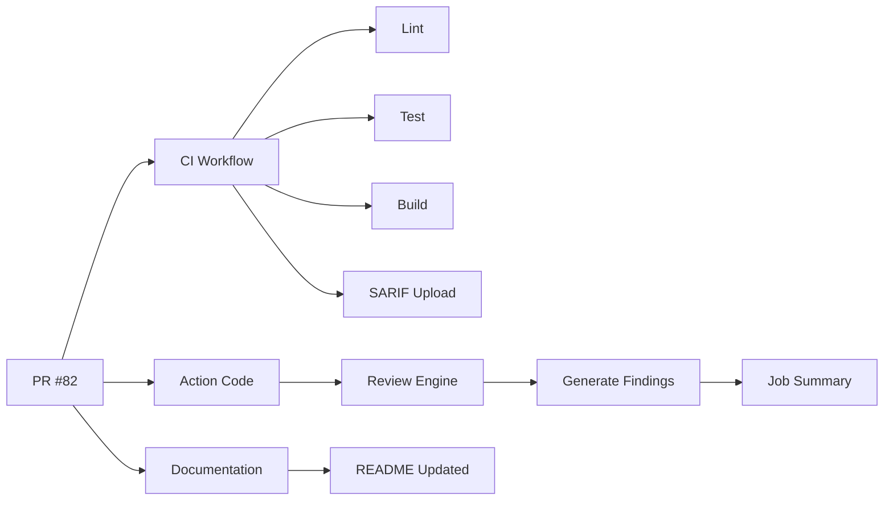

```mermaid
graph LR
    A[PR #82] --> B[CI Workflow]
    A --> C[Action Code]
    A --> D[Documentation]

    B --> E[Lint]
    B --> F[Test]
    B --> G[Build]
    B --> H[SARIF Upload]

    C --> I[Review Engine]
    I --> J[Generate Findings]
    J --> K[Job Summary]

    D --> L[README Updated]
```
