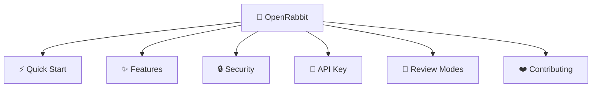

```mermaid
flowchart TD
    OR["🐇 OpenRabbit"]

    OR --> Install["⚡ Quick Start"]
    OR --> Features["✨ Features"]
    OR --> Security["🔒 Security"]
    OR --> API["🔑 API Key"]
    OR --> Modes["📝 Review Modes"]
    OR --> Contribute["❤️ Contributing"]

    click Install "#quickstart-in-2-minutes"
    click Features "#features"
    click Security "#the-open-source-fight"
    click API "#getting-a-free-api-key"
    click Modes "#review-modes"
    click Contribute "#contributing"
```
